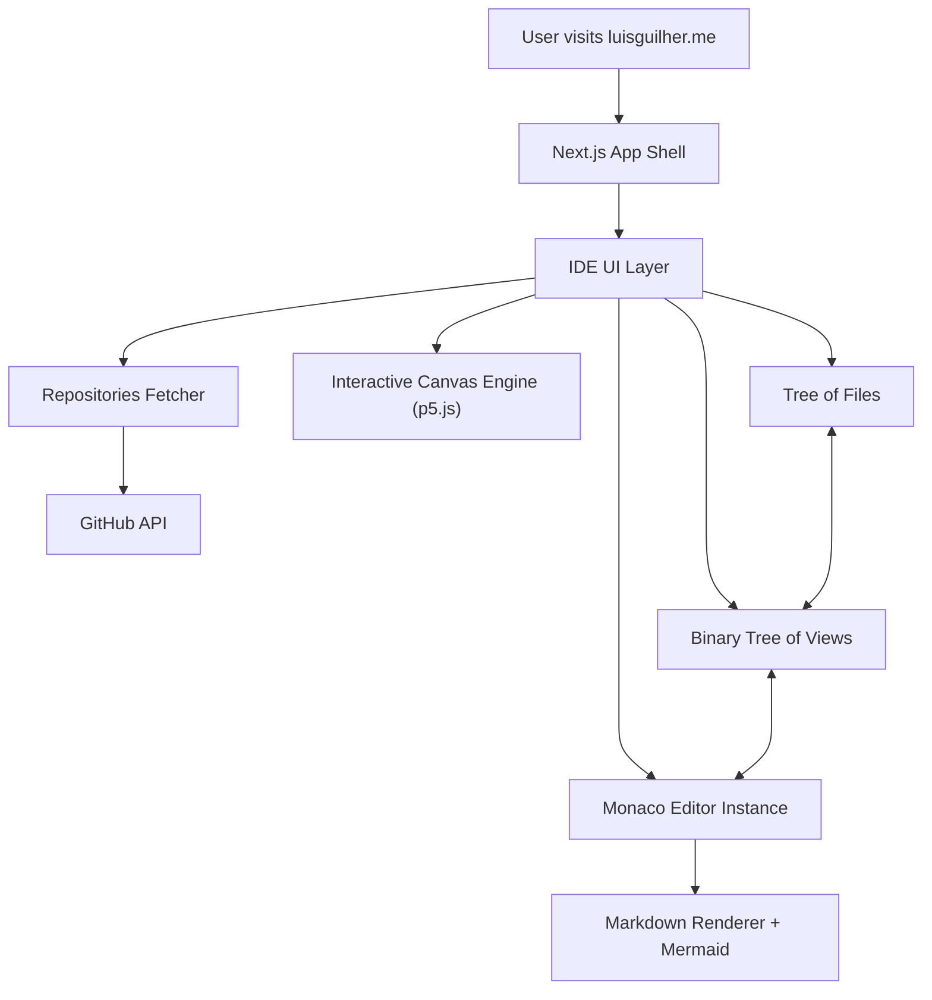
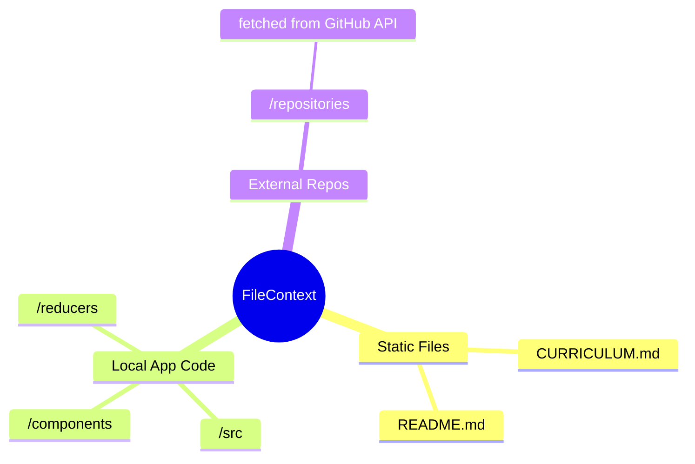
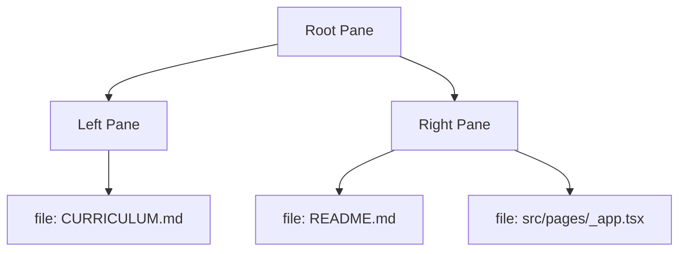

# `luisguilher.me`

### _An interactive, VS Code–powered portfolio. Built with systems thinking, physics-driven design, and stupidly high standards._

<p align="center">
  
</p>

<p align="center">
  <strong>Live:</strong> https://luisguilher.me  
</p>

This is not just a portfolio. It is a **miniature IDE**, wired with real state management, a virtual file system, code rendering, and an internal architecture designed like a production system.

You can explore my resume, open files, read code, view diagrams, inspect repositories, and even print a professional CV using **Ctrl+P** or the download button.

---

# 🧭 Quick Navigation

- **[Live App](https://luisguilher.me)**
- **[Curriculum (Ctrl + P)](public/cv.pdf)**
- **[My GitHub](https://github.com/lguibr)**

---

# 🔥 Core Idea

_A portfolio that behaves like real software._
Everything inside the site simulates **how I think**, **how I design systems**, and **how I write code**.

---

# 🖥️ Architecture (High-Level)



**Design Principles**

- Deterministic UIs
- Stateful, reversible actions
- Tree-based architectures (like real editors)
- Zero magic — everything explicit

---

# 🗂️ Editor Internals

## **File Tree (Domain Data + Repo Fusion)**



## **Binary Tree of Views**

Your split-pane layout is stored as a **binary tree**, just like VS Code.



---

# ✨ Features

### 📄 Interactive Curriculum

My resume is a live markdown file (`CURRICULUM.md`). You can read it, edit it (in memory), and interact with it just like code.

### 🖨️ Print-Ready PDF

Need a copy? Click the **Download PDF** button in the sidebar or press **Ctrl + P**. The app generates a clean, ATS-friendly PDF of my curriculum, stripping away the UI and formatting it perfectly for recruiters.

### 🧩 VS Code–Inspired Interface

Everything feels familiar: explorer, tabs, editor, markdown preview, and diff viewer.

### 📁 GitHub Repositories Browser

My public repositories appear as folders inside the app. You can browse the actual code of my projects without leaving the site.

### 🔍 Global Text Search

Search through all open files and loaded repositories instantly.

### 🎨 Canvas Sketch Engine

p5.js-powered animations that react to your interactions, adding a layer of "physics" to the experience.

### 🎛️ Theme Toggle

**Ctrl + Q** switches between a sleek dark mode and a clean light mode.

---

# 🚀 Selected Projects

### [PonGo](https://pongo.luisguilher.me)


**Multi-Room Pong/Breakout Hybrid**
A real-time multiplayer game combining Pong and Breakout. Built with a **Go backend** using a custom **Actor Model** library (Bollywood) for high concurrency and zero dependencies.

- **Live:** [pongo.luisguilher.me](https://pongo.luisguilher.me)
- **Repo:** [github.com/lguibr/pongo](https://github.com/lguibr/pongo)

### [AlphaTriangle](https://tricrack.luisguilher.me)


**AlphaZero-style AI Agent**
An AI agent that learns to play a custom puzzle game using **Reinforcement Learning**, **MCTS**, and **PyTorch**. Features distributed self-play via Ray and asynchronous stats logging.

- **Playable Game:** [tricrack.luisguilher.me](https://tricrack.luisguilher.me)
- **Repo:** [github.com/lguibr/alphatriangle](https://github.com/lguibr/alphatriangle)

### [MimeFlow](https://mimeflow.luisguilher.me)


**Pose Matching PWA**
An interactive app for practicing poses (dance, yoga, martial arts). Uses **TensorFlow.js** and **BlazePose** for real-time body tracking and scoring in the browser.

- **Live:** [mimeflow.luisguilher.me](https://mimeflow.luisguilher.me)
- **Repo:** [github.com/lguibr/Mimeflow](https://github.com/lguibr/Mimeflow)

### [TonAI](https://tonai.luisguilher.me)


**Create music from text.**
TonAI is a simple web app that lets you create and visualize music using a chat interface. Just describe what you want to hear, and it plays it for you. Built with **React**, **Tailwind**, **Tone.js**, and **Google Gemini**.

- **Live:** [tonai.luisguilher.me](https://tonai.luisguilher.me)
- **Repo:** [github.com/lguibr/tonai](https://github.com/lguibr/tonai)

---

# 🚦 Local Development

```bash
git clone https://github.com/lguibr/luisguilher.me
cd luisguilher.me
yarn install
yarn dev
```

Visit `http://localhost:3000`.

---

# ⌨️ Shortcuts

- Toggle theme → **Ctrl + Q**
- Print CV → **Ctrl + P**
- Restart tour → **Ctrl + Shift + 2**
- Flash loading animation → **Ctrl + Space**
- Toggle Markdown preview → **Double-click editor**

---

# 🤝 Contributing

Open a PR. I care about code clarity and deterministic behavior.

```bash
yarn lint
```

---

# 📄 License

MIT — feel free to fork, remix, or learn from the architecture.
