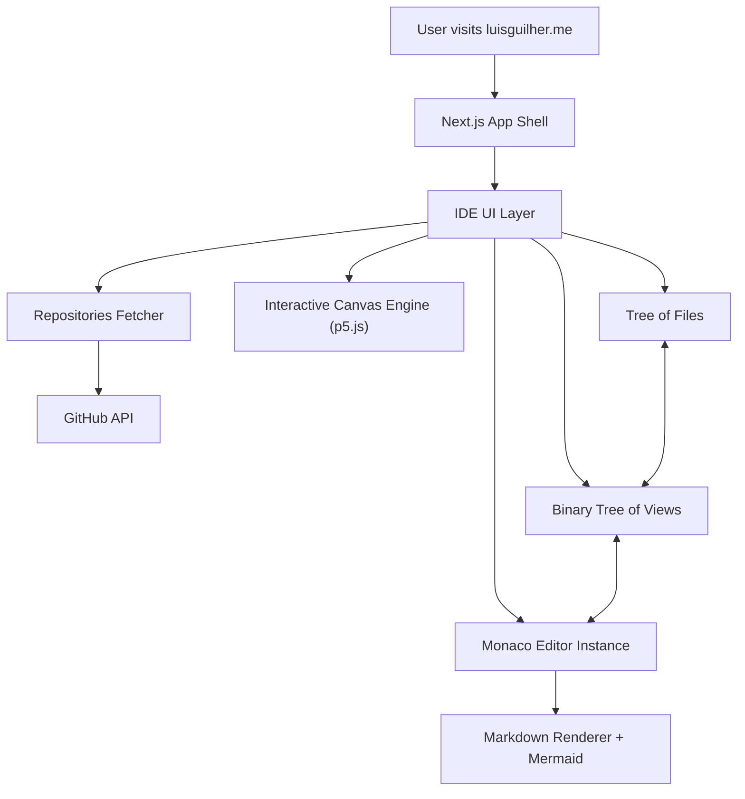
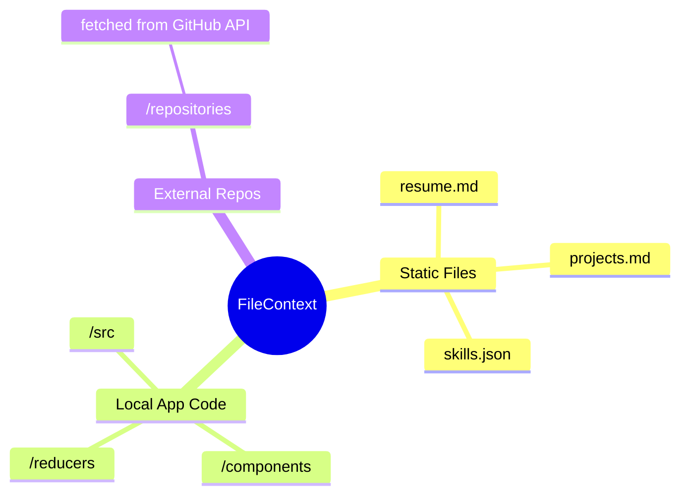
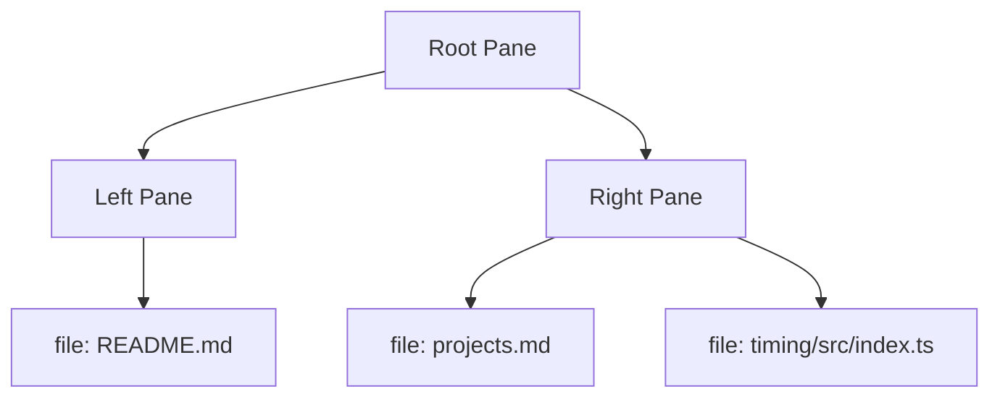

# `luisguilher.me`

### *An interactive, VS Code–powered portfolio. Built with systems thinking, physics-driven design, and stupidly high standards.*

<p align="center">
  
</p>

<p align="center">
  <strong>Live:</strong> https://luisguilher.me  
</p>

<p align="center">
  <a href="https://vercel.com">  </a>
  
  
  
  
</p>

---

# 🌌 Overview

**`luisguilher.me`** is my personal playground:
a fully interactive, VS Code–like environment where you can explore my resume, open files, read code, view diagrams, inspect repositories, and even print a professional CV using **Ctrl+P**.

It’s not “a portfolio”.
It's a **miniature IDE**, wired with real state management, real tree views, real code rendering, real diffing, and internal architecture designed like a production system.

This repo is a mix of:

* ⚡ Systems engineering
* 🎨 UI architecture
* 🧠 Developer experience design
* 🔍 Observability + deterministic behavior
* ⚙️ Physics-driven thinking applied to front-end

---

# 🧭 Quick Navigation

* **[Live App](https://luisguilher.me)**
* **[Curriculum (Ctrl + P inside the app)](public/cv.pdf)**
* **[My GitHub](https://github.com/lguibr)**

---

# 🔥 Core Idea

*A portfolio that behaves like real software.*
Everything inside the site simulates **how I think**, **how I design systems**, and **how I write code**.

---

# 🖥️ Architecture (High-Level)



**Design Principles**

* Deterministic UIs
* Stateful, reversible actions
* Tree-based architectures (like real editors)
* Zero magic — everything explicit

---

# 🗂️ Editor Internals

## **File Tree (Domain Data + Repo Fusion)**



---

## **Binary Tree of Views**

Your split-pane layout is stored as a **binary tree**, just like VS Code.



---

# ✨ Features

### 🧩 VS Code–Inspired Interface

Everything feels familiar: explorer, tabs, editor, markdown preview, diff viewer.

### 🧭 Interactive Onboarding Tour

Guides users through the environment step-by-step.

### 🛠️ Self-Hosted Source Code Viewer

Like opening a project folder inside VS Code.

### 📁 GitHub Repositories Browser

Your public repos appear as folders inside the app — fully browsable.

### 🔍 Global Text Search

Search through open files or modified buffers.

### 🧬 Diff Mode (Source Control Tab)

Compare file content with the original version.

### 📝 Markdown Preview (with Mermaid)

Full diagram rendering, live toggling between raw/editor.

### 🎨 Canvas Sketch Engine

p5.js-powered animations tied to IDE interactions.

### 🖨️ Print-Ready CV

Generated via `Ctrl + P` with layout optimized for recruiters.

### 🎛️ Theme Toggle

`Ctrl + Q` → Light/Dark

---

# 🧪 Stack

* **Next.js 14**
* **React 18**
* **TypeScript**
* **Monaco Editor**
* **p5.js**
* **Styled Components**
* **Mermaid**
* **React Resizable Panels**
* **Reactour**
* **Vercel (Edge deploy)**

---

# 🏗️ Project Structure (Clean Overview)

```bash
luisguilher.me/
├── public/              # Static assets
├── src/
│   ├── assets/          # Resume, projects, skillsets
│   ├── components/      # UI components
│   ├── contexts/        # File tree, views, theme, loading...
│   ├── hooks/           # Custom hooks
│   ├── pages/           # Next.js routes
│   ├── reducers/        # State reducers
│   ├── services/        # API integrations
│   └── styles/          # Themes, global styles
└── ...
```

---

# 🧠 Why This Exists

I wanted a portfolio that **shows**, not “tells”.

Instead of a static page saying “I like TypeScript”,
you actually interact with a **real TypeScript environment**.

Instead of a PDF saying “I do system design”,
you see system-level structures inside the app.

Instead of reading “I think like an engineer”,
you walk inside my mental model.

---

# 🚦 Local Development

```bash
git clone https://github.com/lguibr/luisguilher.me
cd luisguilher.me
yarn install
yarn dev
```

Visit `http://localhost:3000`.

---

# ⌨️ Shortcuts

* Toggle theme → **Ctrl + Q**
* Print CV → **Ctrl + P**
* Restart tour → **Ctrl + Shift + 2**
* Flash loading animation → **Ctrl + Space**
* Toggle Markdown editor → *Double-click markdown preview*

---

# 🤝 Contributing

Open a PR.
I care about code clarity and deterministic behavior — lint before committing:

```bash
yarn lint
```

---

# 📄 License

MIT — feel free to fork, remix, or learn from the architecture.

---

# 🛸 Final Note

Thanks for visiting.
Explore the code. Break it. Improve it.
The whole point of this project is **experimentation**.
